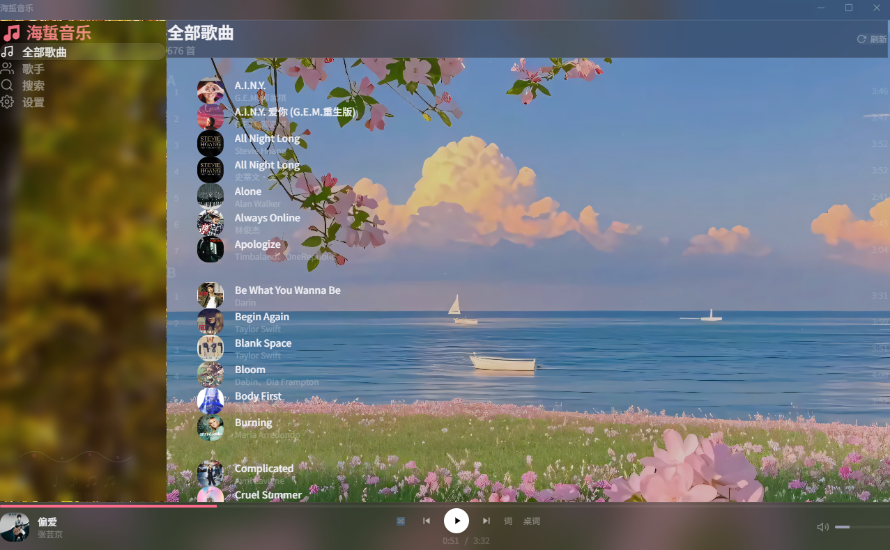
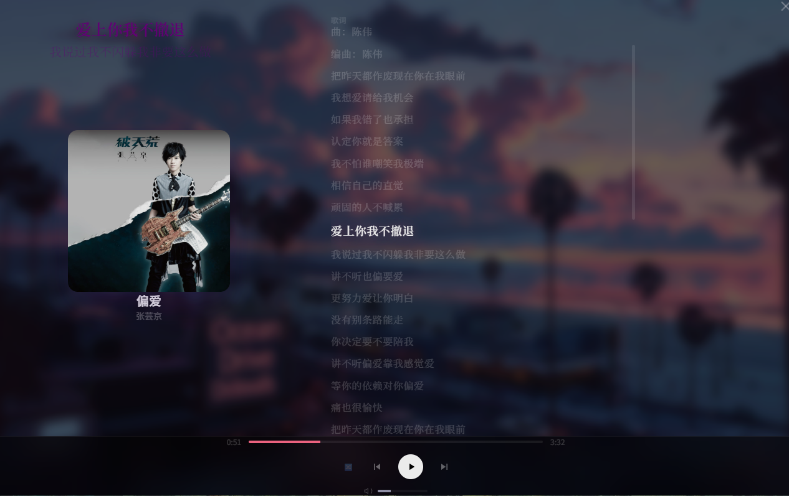
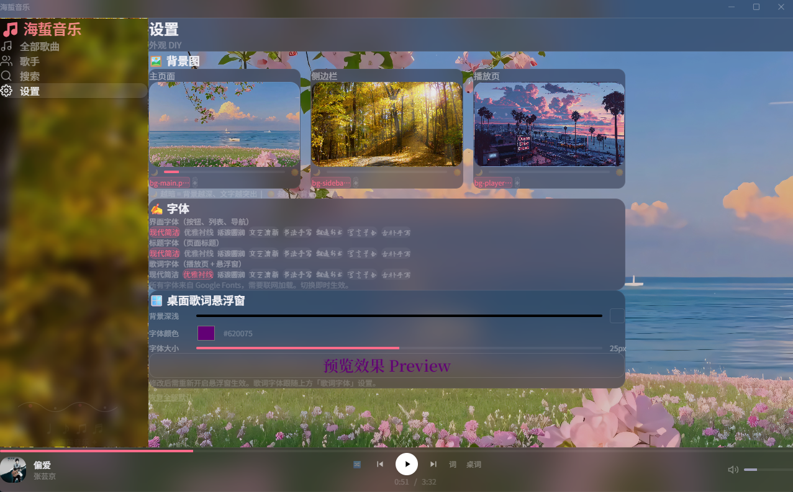

# 🎵 海蜇音乐播放器 (HaiZhe Music Player)

> 本地音乐播放器 · Electron 桌面端 + Web 网页端 · Apple Music 风格 · 桌面歌词悬浮窗

一个基于 **Python FastAPI + React + Electron** 的本地音乐播放器，扫描本地 MP3 文件，自动提取 ID3 元数据/封面/歌词，提供完整的桌面端播放体验。

<p align="center">
  
  
  
  
</p>

---

## ✨ 功能一览

| 模块 | 功能 |
|------|------|
| 🎵 播放引擎 | MP3 流式播放（HTTP Range 请求 + 128KB 缓冲）、进度拖拽、音量调节/静音、音量记忆 |
| 🔀 播放模式 | 顺序播放 / 列表循环 / 单曲循环 / 随机播放 · 模式记忆持久化 |
| 📝 歌词系统 | LRC 文件解析 · 全屏歌词滚动高亮 · 点击歌词行跳转 · 自动居中滚动 |
| 🖼️ 封面系统 | MP3 ID3 内嵌封面提取 · 150px 磁盘缓存秒加载 · 全屏原图按需读取 |
| 🎤 歌手分类 | 按首字母分组 · 多歌手智能拆分（`徐良、阿悄` → 两个独立歌手） |
| 🔍 搜索 | 实时搜索歌名/歌手 |
| 🎨 背景 DIY | 三区域独立背景（主页/侧边栏/全屏播放） · 本地上传替换 · 亮度调节 |
| ✍️ 字体系统 | 8 款中文字体可选 · 界面/标题/歌词三类独立配置 · 即时生效 |
| 🪟 桌面歌词 | Electron 原生透明置顶窗口 · 自定义颜色/字号/背景深度 · 打游戏也能看歌词 |
| 📱 响应式 | PC + 手机浏览器均可访问（同 WiFi） |
| 📦 播放记忆 | 关闭应用 → 下次启动自动恢复到上次播放的歌和模式 |

---

## 📸 界面展示

<table>
<tr>
<td align="center"><b>🎵 主页</b><br/>全部歌曲 A-Z 排序 + 毛玻璃侧边栏</td>
<td align="center"><b>📝 全屏歌词 & 桌面悬浮窗</b><br/>左封面 · 右歌词 · 左下角透明浮窗</td>
<td align="center"><b>⚙️ 设置</b><br/>三区域背景切换 · 字体选择 · 歌词悬浮窗调色</td>
</tr>
<tr>
<td></td>
<td></td>
<td></td>
</tr>
</table>

---

## 🏗️ 技术架构

```
┌──────────────────────────────────────────────────┐
│                  Electron Shell                    │
│  ┌─────────────┐  ┌──────────┐  ┌─────────────┐  │
│  │  main.js    │  │ preload  │  │ lyrics.html │  │
│  │ 窗口管理     │  │ IPC 桥接  │  │ 桌面歌词窗   │  │
│  └──────┬──────┘  └──────────┘  └─────────────┘  │
│         │ spawn                                    │
├─────────┼─────────────────────────────────────────┤
│    ┌────▼───────────────────────────────────┐     │
│    │       React 19 + TypeScript             │     │
│    │  Vite · Tailwind CSS · Framer Motion    │     │
│    │  ┌──────┐ ┌──────┐ ┌───────────────┐   │     │
│    │  │Player│ │Search│ │Settings(字体/背景)│  │     │
│    │  │ Bar  │ │ Page │ │               │   │     │
│    │  └──────┘ └──────┘ └───────────────┘   │     │
│    └────────────────┬───────────────────────┘     │
└─────────────────────┼─────────────────────────────┘
                      │ HTTP (localhost:8765)
┌─────────────────────┼─────────────────────────────┐
│           ┌─────────▼──────────────────────┐      │
│           │   FastAPI (Python)              │      │
│           │  · 流媒体 (Range 请求)          │      │
│           │  · ID3 元数据 / APIC 封面提取   │      │
│           │  · LRC 歌词解析                 │      │
│           │  · 封面磁盘缓存 (150px JPEG)    │      │
│           │  · GZip 压缩 · 定时 GC          │      │
│           └────────────────────────────────┘      │
│                      后端                          │
└───────────────────────────────────────────────────┘
```

### 技术选型

| 层 | 技术 | 理由 |
|----|------|------|
| **后端** | FastAPI + uvicorn | 高性能异步 HTTP，原生 Range 请求支持 |
| **元数据** | mutagen (Pillow) | Python 最成熟的 MP3/ID3 库 |
| **前端** | React 19 + TypeScript | 组件化开发，类型安全 |
| **样式** | Tailwind CSS | 原子化 CSS，Apple Music 暗色风格 |
| **动画** | Framer Motion | 列表入场动画、歌词过渡 |
| **桌面壳** | Electron 39 | 跨平台桌面打包 + 原生透明歌词窗口 |
| **IPC** | Electron contextBridge | 安全进程间通信 |

---

## ⚡ 核心实现原理

### 1. 流媒体播放（HTTP Range 请求）

```
前端 <audio> 标签请求 /api/stream/{id}
  → 浏览器自动发 Range: bytes=0-xxx
  → FastAPI 解析 → f.seek(start) → 128KB 块读取 → StreamingResponse 206
```

支持拖拽进度条时浏览器发起多次 Range 请求，后端直接从文件偏移量读取，无需预加载整个 MP3。10MB 歌曲从 ~1280 次 `read()` 降到 ~80 次。

### 2. 封面提取与缓存

```
启动扫描：
  遍历 MP3 → mutagen.ID3 读取 APIC 帧 → Pillow 缩放到 150×150
  → JPEG 存入 backend/cache/covers/{song_id}.jpg

运行时：
  列表请求 /api/cover/{id}?size=150 → FileResponse 直接读磁盘 → <5ms
  全屏请求 /api/cover/{id}?size=500 → 从 MP3 按需提取原图 → 用完即释放
```

**之前的问题**：676 张 1000×1000 原图被 Chromium 全量解码到 GPU → 2.7GB 内存。现在列表图 150px 仅 ~90KB/张，全屏大图用 `key` 强制 React 卸载时释放，切歌后 `src=''` 主动释放 Chromium 解码位图。

### 3. 音频缓冲释放

```js
// ✅ 标准做法（修复了缓冲泄漏）
audio.src = '';        // 触发 Chromium media resource abort + 释放解码缓冲
audio.src = newUrl;    // 加载新源

// ❌ 之前的方式（有泄漏）
audio.removeAttribute('src');  // 只删 HTML 属性，JS 属性仍指向旧 URL
audio.load();                  // 行为未定义，旧缓冲可能不被释放
```

这是导致"听 50 首歌涨 500MB"的根因。`src=''` 是 Chromium 规范中明确触发媒体资源释放的标准方式，和之前修复的封面释放形成同一套内存管理策略。

### 4. 渲染性能优化

| 优化 | 效果 |
|------|------|
| `onTimeUpdate` 500ms 节流 + `timeRef` | 渲染频率减半，歌词同步零延迟（读 ref 跳过 React 链路） |
| `React.memo` 6 个核心组件 | 列表项不因 timeupdate 重渲染 |
| 稳定 `useMemo` context | 避免每次渲染生成新引用触发消费者全量重渲染 |
| 拆分 `SongListContent` memo | 676 行列表在 timeupdate 时完全跳过 VDOM diff |

### 5. 桌面歌词透明窗口

```
Electron IPC 架构：
  React (渲染进程) → ipcRenderer.send('lyric-update', { text, next })
  → main.js (主进程) → lyricWin.webContents.send('lyric-data', data)
  → lyrics.html (独立窗口) → 更新 DOM

窗口属性：
  transparent: true         → 背景完全透明
  alwaysOnTop: true         → 始终置顶（screen-saver 级别）
  frame: false              → 无边框
  skipTaskbar: true         → 不显示在任务栏
```

配置实时同步：用户改设置 → localStorage → tick 循环 500ms 比对缓存 → 仅变化时才发 IPC `lyric-config`。

---

## 📂 项目结构

```
music-player/
├── start.bat                  # 网页版启动
├── start-desktop.bat          # 桌面版启动
├── setup-first-run.bat        # 首次运行：安装 Python 依赖
├── package.json               # Electron 入口
├── electron-builder.yml       # 打包配置
│
├── backend/
│   ├── main.py                # FastAPI 服务 (端口 8765)
│   ├── scanner.py             # MP3 扫描 · ID3 解析 · 封面预提取
│   ├── lyrics.py              # LRC 歌词解析
│   ├── models.py              # Pydantic 数据模型
│   ├── config.json            # 配置文件（音乐目录路径）
│   ├── requirements.txt       # Python 依赖
│   └── cache/covers/          # 封面缩略图磁盘缓存 (150px JPEG)
│
├── frontend/
│   ├── src/
│   │   ├── main.tsx           # React 入口
│   │   ├── App.tsx            # 路由 + 全局布局 + 背景初始化
│   │   ├── store.tsx          # 播放器状态管理 (useReducer + Context)
│   │   ├── api.ts             # 后端 API 调用
│   │   ├── types.ts           # TypeScript 类型定义
│   │   ├── components/
│   │   │   ├── Sidebar.tsx    # 侧边栏导航
│   │   │   ├── PlayerBar.tsx  # 底部播放栏 + 全屏歌词面板 + PiP 悬浮窗
│   │   │   ├── TitleBar.tsx   # 自定义标题栏（Electron 环境）
│   │   │   └── FloatingLyrics.tsx  # 设置页悬浮窗预览
│   │   └── pages/
│   │       ├── AllSongsPage.tsx    # 全部歌曲（A-Z 分组）
│   │       ├── ArtistsPage.tsx     # 歌手列表
│   │       ├── ArtistSongsPage.tsx # 歌手歌曲
│   │       ├── SearchPage.tsx      # 搜索页
│   │       └── SettingsPage.tsx    # 设置（背景/字体/悬浮窗配置）
│   └── public/bg/
│       ├── main/              # 主页背景图
│       ├── sidebar/           # 侧边栏背景图
│       └── player/            # 全屏播放页背景图
│
├── electron/
│   ├── main.js                # Electron 主进程 · 窗口管理 · 子进程生命周期
│   ├── preload.js             # contextBridge IPC 暴露
│   └── lyrics.html            # 桌面歌词独立窗口
│
└── release/win-unpacked/      # electron-builder 打包输出
    └── HaiZhe Music.exe
```

---

## 🚀 快速开始

### 环境要求

- **Python 3.9+**
- **Node.js 18+**（仅桌面版需要）
- **Windows / macOS / Linux**

### 1. 安装依赖

```bash
# Python 依赖
cd backend
pip install -r requirements.txt

# Node 依赖（仅桌面版）
cd ..
npm install
```

### 2. 配置音乐目录

编辑 `backend/config.json`：

```json
{
  "music_dir": "D:\\你的音乐文件夹"
}
```

音乐目录下应有 `.mp3` 文件（封面和歌词会从同目录的 `.lrc` 文件和 MP3 ID3 标签中读取）。

### 3. 启动

```bash
# 网页版（PC + 手机均可访问）
双击 start.bat
# 或手动：
cd backend && python main.py
cd frontend && npx vite --host 0.0.0.0

# 桌面版（Electron，含透明悬浮窗）
双击 start-desktop.bat
```

- **PC 访问**：`http://localhost:5173`
- **手机访问**：`http://<你的电脑IP>:5173`（同 WiFi）

---

## 🎛️ 配置与自定义

### 背景图

三区域独立背景（主页/侧边栏/全屏播放页）：

1. 将图片放入 `frontend/public/bg/{main|sidebar|player}/`
2. 应用内点击侧边栏 ⚙️ **设置** → 可视化选择背景
3. 支持本地上传替换，选择保存在浏览器本地

### 字体

设置页提供 8 款中文字体选择：思源黑体、ZCOOL 快乐圆体、小薇体、马山手写、志莽行楷、Noto Serif SC、Noto Sans SC、系统默认。

### 桌面歌词

设置页可调节：背景深度（完全透明 ~ 深色）、字体颜色、字号、字体。

---

## 📦 打包分发

```bash
npx electron-builder --win --x64
```

输出在 `release/win-unpacked/`，复制给朋友即可使用：

1. 运行 `setup-first-run.bat`（安装 Python 依赖）
2. 修改 `resources/backend/config.json` 指向自己的音乐目录
3. 双击 `HaiZhe Music.exe` → 开听

> **局限**：当前打包版仍需目标电脑有 Python 3.9+。完全免 Python 的独立 exe 需要用 PyInstaller 编译后端，当前 Anaconda 环境有兼容问题，待后续解决。

---

## 📋 迭代精华

以下是开发过程中解决的关键技术问题：

### 内存管理攻坚

| 版本 | 问题 | 根因 | 修复 |
|------|------|------|------|
| V8-V9 | 听 1 小时内存 → 2GB+ | 676 张 1000×1000 封面全量解码到 GPU | 150px 磁盘缓存缩略图 |
| V9 | 切歌内存持续上涨 | `removeAttribute('src')` 不释放音频缓冲 | `audio.src = ''` |
| V10 | 全屏"词"缓慢泄漏 | 原图无释放机制 | `key={songId}` 强制卸载 + `src=''` cleanup |
| V10 | `key` on `` 反而爆内存 | React key 变化触发重新解码管线 | 改用 `ref` + cleanup 中 `src=''` |
| V10.1 | 676 行列表每 500ms 重渲染 | 1690 闭包/秒 → GC 跟不上 | `SongListContent` memo 隔离 |

**最终稳定基线**：500MB 空闲 → 播放中 500-800MB → 不再单边上涨。

### 播放体验优化

| 问题 | 修复 |
|------|------|
| 第一首歌卡 20s | 应用启动时后台预热：fetch 歌曲列表 + 创建隐藏 `<audio>` 加载第一首到 `canplay` |
| 切歌播放延迟 | `canplay` 事件驱动播放，去掉 50ms 人为延迟 |
| 悬浮窗歌词不同步 | `useEffect` 依赖从 `currentTime` 改为 `[pipOn, songId]`，通过 `timeRef` 读实时位置 |
| 桌面歌词始终"等待播放" | IPC 消息在窗口加载完成前到达被丢弃 → `lyricReady` 标志位 + 暂存 `pendingLyricCfg` |

### 多歌手拆分

```python
# scanner.py
ARTIST_SPLIT_RE = re.compile(r"[、,，/&]|\bfeat\.?\b", re.IGNORECASE)

"徐良、阿悄" → ["徐良", "阿悄"]   # 两个独立歌手
"汪苏泷 / BY2" → ["汪苏泷", "BY2"]
"周杰伦 feat. 蔡依林" → ["周杰伦", "蔡依林"]
```

一首歌同时出现在所有合作歌手的页面中，不会重复计数。

---

## 🔮 后续规划

- [ ] PyInstaller 打包 → 完全免 Python 的独立 .exe
- [ ] 系统托盘 + 最小化到托盘
- [ ] 全局快捷键（播放/暂停/切歌）
- [ ] 播放历史 + 收藏
- [ ] macOS / Linux 测试与适配

---

## 📄 许可

MIT License

---

Made in China, Nan
